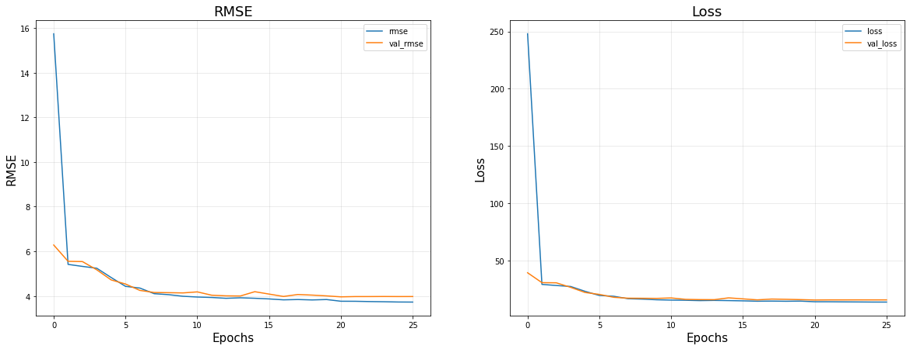

# KLOSA
Klosa 데이터를 활용한 MMSE 점수 예측
```python
import pandas as pd
import numpy as np
import tensorflow as tf
from keras.layers import LSTM
```


```python
pd.set_option('display.max_columns',None)
pd.set_option('display.max_rows',None)
```


```python
df=pd.read_csv("MainData.csv")
df.shape
```


    (11092, 248)


```python
# 제거 할 변수 추가 < region1, 낙상, adl ,iadl, 악력 > 제거

df=df[df.columns.drop(list(df.filter(regex=r'(region1|adl|C056)')))]
```


```python
df1=df.loc[:,'w01hhsize':'w01present_labor']
df2=df.loc[:,'w02hhsize':'w02present_labor']
df3=df.loc[:,'w03hhsize':'w03present_labor']
df4=df.loc[:,'w04hhsize':'w04present_labor']
df5=df.loc[:,'w05hhsize':'w05present_labor']
df6=df.loc[:,'w06hhsize':'w06present_labor']
df7=df.loc[:,'w07hhsize':'w07present_labor']
df8=df.loc[:,'w08hhsize':'w08present_labor']
```


```python
# 1차 설문조사에 alc 과  adl점수가 없음.
print(df1.shape,df2.shape,df3.shape,df4.shape,df5.shape,df6.shape,df7.shape,df8.shape)
```

    (11092, 26) (11092, 27) (11092, 27) (11092, 27) (11092, 27) (11092, 27) (11092, 27) (11092, 27)


```python
# 여기서 11092 명 -> 4128 은 2차 ~ 8차 까지의 설문데이터가 모두 있는 경우를 의미함.
df_new=pd.concat([df2,df3,df4,df5,df6,df7,df8],axis=1).dropna(axis=0)
df_new.shape
```


    (4128, 189)


```python
X=df_new.loc[:,:'w07present_labor']
y=df_new.w08mmse
```


```python
from sklearn.preprocessing import MinMaxScaler

sc=MinMaxScaler()

X=pd.DataFrame(sc.fit_transform(X))
```


```python
X.shape
```


    (4128, 162)


```python
X=X.values.reshape(X.shape[0],6,27)
print(X.shape,y.shape) # (size,timestep,feature)
```

    (4128, 6, 27) (4128,)


```python
# Train Test Set 으로 Split 하자
from sklearn.model_selection import train_test_split

X_train, X_test, y_train, y_test = train_test_split(X,y,test_size=0.2,stratify=y, random_state=42)
```


```python
print(X_train.shape,X_test.shape)
```

    (3302, 6, 27) (826, 6, 27)


# LSTM Many-to-one


```python
# LSTM many-to-one 구현
K.clear_session()
model2 = Sequential() # Sequeatial Model
model2.add(LSTM(20, input_shape=(6, 27),return_sequences=False)) # (timestep, feature)
model2.add(Dense(10,activation='relu'))
model2.add(Dense(1)) # output = 1
model2.compile(optimizer='adam', loss='mse', metrics=[tf.keras.metrics.RootMeanSquaredError()])

model2.summary()
```

    Model: "sequential"
    _________________________________________________________________
     Layer (type)                Output Shape              Param #   
    =================================================================
     lstm (LSTM)                 (None, 20)                3840      
                                                                     
     dense (Dense)               (None, 10)                210       
                                                                     
     dense_1 (Dense)             (None, 1)                 11        
                                                                     
    =================================================================
    Total params: 4,061
    Trainable params: 4,061
    Non-trainable params: 0
    _________________________________________________________________


```python
from tensorflow.keras.callbacks import EarlyStopping, ModelCheckpoint, ReduceLROnPlateau

es = EarlyStopping(monitor='val_loss', mode='min', verbose=1, patience=5)
mc = ModelCheckpoint("lstm.h5", save_best_only=True)
rlr = ReduceLROnPlateau(factor=0.2, patience=3)

# fit model
history = model2.fit(X_train, y_train, batch_size=32, validation_split=0.2, epochs=100,callbacks=[es,rlr])
```

    Epoch 1/100


    2023-01-13 13:26:22.287733: I tensorflow/core/grappler/optimizers/custom_graph_optimizer_registry.cc:113] Plugin optimizer for device_type GPU is enabled.
    2023-01-13 13:26:22.399314: I tensorflow/core/grappler/optimizers/custom_graph_optimizer_registry.cc:113] Plugin optimizer for device_type GPU is enabled.


    12/83 [===>..........................] - ETA: 0s - loss: 623.5712 - root_mean_squared_error: 24.9714

    2023-01-13 13:26:22.489010: I tensorflow/core/grappler/optimizers/custom_graph_optimizer_registry.cc:113] Plugin optimizer for device_type GPU is enabled.


    83/83 [==============================] - 2s 12ms/step - loss: 430.7932 - root_mean_squared_error: 20.7556 - val_loss: 218.2996 - val_root_mean_squared_error: 14.7750 - lr: 0.0010
    Epoch 2/100
     1/83 [..............................] - ETA: 0s - loss: 215.5128 - root_mean_squared_error: 14.6804

    2023-01-13 13:26:23.385371: I tensorflow/core/grappler/optimizers/custom_graph_optimizer_registry.cc:113] Plugin optimizer for device_type GPU is enabled.
    2023-01-13 13:26:23.426105: I tensorflow/core/grappler/optimizers/custom_graph_optimizer_registry.cc:113] Plugin optimizer for device_type GPU is enabled.


    83/83 [==============================] - 1s 9ms/step - loss: 117.2822 - root_mean_squared_error: 10.8297 - val_loss: 52.2553 - val_root_mean_squared_error: 7.2288 - lr: 0.0010
    Epoch 3/100
    83/83 [==============================] - 1s 9ms/step - loss: 35.2740 - root_mean_squared_error: 5.9392 - val_loss: 31.0790 - val_root_mean_squared_error: 5.5749 - lr: 0.0010
    Epoch 4/100
    83/83 [==============================] - 1s 8ms/step - loss: 28.3488 - root_mean_squared_error: 5.3244 - val_loss: 30.6286 - val_root_mean_squared_error: 5.5343 - lr: 0.0010
    Epoch 5/100
    83/83 [==============================] - 1s 9ms/step - loss: 28.2241 - root_mean_squared_error: 5.3126 - val_loss: 30.5828 - val_root_mean_squared_error: 5.5302 - lr: 0.0010
    Epoch 6/100
    83/83 [==============================] - 1s 9ms/step - loss: 26.6052 - root_mean_squared_error: 5.1580 - val_loss: 24.7714 - val_root_mean_squared_error: 4.9771 - lr: 0.0010
    Epoch 7/100
    83/83 [==============================] - 1s 9ms/step - loss: 21.6378 - root_mean_squared_error: 4.6516 - val_loss: 21.6075 - val_root_mean_squared_error: 4.6484 - lr: 0.0010
    Epoch 8/100
    83/83 [==============================] - 1s 9ms/step - loss: 19.5872 - root_mean_squared_error: 4.4257 - val_loss: 19.6128 - val_root_mean_squared_error: 4.4286 - lr: 0.0010
    Epoch 9/100
    83/83 [==============================] - 1s 8ms/step - loss: 17.1319 - root_mean_squared_error: 4.1391 - val_loss: 16.0604 - val_root_mean_squared_error: 4.0075 - lr: 0.0010
    Epoch 10/100
    83/83 [==============================] - 1s 8ms/step - loss: 15.1135 - root_mean_squared_error: 3.8876 - val_loss: 14.5445 - val_root_mean_squared_error: 3.8137 - lr: 0.0010
    Epoch 11/100
    83/83 [==============================] - 1s 9ms/step - loss: 13.8105 - root_mean_squared_error: 3.7162 - val_loss: 13.6497 - val_root_mean_squared_error: 3.6946 - lr: 0.0010
    Epoch 12/100
    83/83 [==============================] - 1s 8ms/step - loss: 12.9099 - root_mean_squared_error: 3.5930 - val_loss: 12.7121 - val_root_mean_squared_error: 3.5654 - lr: 0.0010
    Epoch 13/100
    83/83 [==============================] - 1s 9ms/step - loss: 12.5799 - root_mean_squared_error: 3.5468 - val_loss: 13.1452 - val_root_mean_squared_error: 3.6256 - lr: 0.0010
    Epoch 14/100
    83/83 [==============================] - 1s 9ms/step - loss: 12.1945 - root_mean_squared_error: 3.4921 - val_loss: 12.5055 - val_root_mean_squared_error: 3.5363 - lr: 0.0010
    Epoch 15/100
    83/83 [==============================] - 1s 9ms/step - loss: 12.1127 - root_mean_squared_error: 3.4803 - val_loss: 12.1799 - val_root_mean_squared_error: 3.4900 - lr: 0.0010
    Epoch 16/100
    83/83 [==============================] - 1s 9ms/step - loss: 11.8462 - root_mean_squared_error: 3.4418 - val_loss: 11.8614 - val_root_mean_squared_error: 3.4440 - lr: 0.0010
    Epoch 17/100
    83/83 [==============================] - 1s 8ms/step - loss: 11.6834 - root_mean_squared_error: 3.4181 - val_loss: 11.6091 - val_root_mean_squared_error: 3.4072 - lr: 0.0010
    Epoch 18/100
    83/83 [==============================] - 1s 9ms/step - loss: 11.5442 - root_mean_squared_error: 3.3977 - val_loss: 11.6950 - val_root_mean_squared_error: 3.4198 - lr: 0.0010
    Epoch 19/100
    83/83 [==============================] - 1s 9ms/step - loss: 11.4597 - root_mean_squared_error: 3.3852 - val_loss: 11.9504 - val_root_mean_squared_error: 3.4569 - lr: 0.0010
    Epoch 20/100
    83/83 [==============================] - 1s 8ms/step - loss: 11.4537 - root_mean_squared_error: 3.3843 - val_loss: 11.4576 - val_root_mean_squared_error: 3.3849 - lr: 0.0010
    Epoch 21/100
    83/83 [==============================] - 1s 9ms/step - loss: 11.3297 - root_mean_squared_error: 3.3660 - val_loss: 11.9202 - val_root_mean_squared_error: 3.4526 - lr: 0.0010
    Epoch 22/100
    83/83 [==============================] - 1s 9ms/step - loss: 11.3357 - root_mean_squared_error: 3.3669 - val_loss: 11.4862 - val_root_mean_squared_error: 3.3891 - lr: 0.0010
    Epoch 23/100
    83/83 [==============================] - 1s 9ms/step - loss: 11.2612 - root_mean_squared_error: 3.3558 - val_loss: 11.3391 - val_root_mean_squared_error: 3.3674 - lr: 0.0010
    Epoch 24/100
    83/83 [==============================] - 1s 9ms/step - loss: 11.0934 - root_mean_squared_error: 3.3307 - val_loss: 11.3723 - val_root_mean_squared_error: 3.3723 - lr: 0.0010
    Epoch 25/100
    83/83 [==============================] - 1s 9ms/step - loss: 11.1215 - root_mean_squared_error: 3.3349 - val_loss: 11.2380 - val_root_mean_squared_error: 3.3523 - lr: 0.0010
    Epoch 26/100
    83/83 [==============================] - 1s 8ms/step - loss: 11.1856 - root_mean_squared_error: 3.3445 - val_loss: 11.2231 - val_root_mean_squared_error: 3.3501 - lr: 0.0010
    Epoch 27/100
    83/83 [==============================] - 1s 8ms/step - loss: 11.0880 - root_mean_squared_error: 3.3299 - val_loss: 11.2352 - val_root_mean_squared_error: 3.3519 - lr: 0.0010
    Epoch 28/100
    83/83 [==============================] - 1s 9ms/step - loss: 10.8610 - root_mean_squared_error: 3.2956 - val_loss: 11.3858 - val_root_mean_squared_error: 3.3743 - lr: 0.0010
    Epoch 29/100
    83/83 [==============================] - 1s 9ms/step - loss: 11.0840 - root_mean_squared_error: 3.3293 - val_loss: 11.1975 - val_root_mean_squared_error: 3.3463 - lr: 0.0010
    Epoch 30/100
    83/83 [==============================] - 1s 9ms/step - loss: 10.9841 - root_mean_squared_error: 3.3142 - val_loss: 11.5679 - val_root_mean_squared_error: 3.4012 - lr: 0.0010
    Epoch 31/100
    83/83 [==============================] - 1s 9ms/step - loss: 10.8088 - root_mean_squared_error: 3.2877 - val_loss: 11.2421 - val_root_mean_squared_error: 3.3529 - lr: 0.0010
    Epoch 32/100
    83/83 [==============================] - 1s 9ms/step - loss: 10.9098 - root_mean_squared_error: 3.3030 - val_loss: 11.1803 - val_root_mean_squared_error: 3.3437 - lr: 0.0010
    Epoch 33/100
    83/83 [==============================] - 1s 9ms/step - loss: 10.7249 - root_mean_squared_error: 3.2749 - val_loss: 11.1253 - val_root_mean_squared_error: 3.3355 - lr: 0.0010
    Epoch 34/100
    83/83 [==============================] - 1s 9ms/step - loss: 10.6824 - root_mean_squared_error: 3.2684 - val_loss: 11.1312 - val_root_mean_squared_error: 3.3364 - lr: 0.0010
    Epoch 35/100
    83/83 [==============================] - 1s 9ms/step - loss: 10.6230 - root_mean_squared_error: 3.2593 - val_loss: 11.7229 - val_root_mean_squared_error: 3.4239 - lr: 0.0010
    Epoch 36/100
    83/83 [==============================] - 1s 9ms/step - loss: 10.6762 - root_mean_squared_error: 3.2674 - val_loss: 11.1892 - val_root_mean_squared_error: 3.3450 - lr: 0.0010
    Epoch 37/100
    83/83 [==============================] - 1s 8ms/step - loss: 10.4512 - root_mean_squared_error: 3.2328 - val_loss: 11.1179 - val_root_mean_squared_error: 3.3344 - lr: 2.0000e-04
    Epoch 38/100
    83/83 [==============================] - 1s 8ms/step - loss: 10.4505 - root_mean_squared_error: 3.2327 - val_loss: 11.0828 - val_root_mean_squared_error: 3.3291 - lr: 2.0000e-04
    Epoch 39/100
    83/83 [==============================] - 1s 9ms/step - loss: 10.3755 - root_mean_squared_error: 3.2211 - val_loss: 11.0664 - val_root_mean_squared_error: 3.3266 - lr: 2.0000e-04
    Epoch 40/100
    83/83 [==============================] - 1s 9ms/step - loss: 10.3861 - root_mean_squared_error: 3.2227 - val_loss: 11.0685 - val_root_mean_squared_error: 3.3269 - lr: 2.0000e-04
    Epoch 41/100
    83/83 [==============================] - 1s 9ms/step - loss: 10.3702 - root_mean_squared_error: 3.2203 - val_loss: 11.1111 - val_root_mean_squared_error: 3.3333 - lr: 2.0000e-04
    Epoch 42/100
    83/83 [==============================] - 1s 9ms/step - loss: 10.3614 - root_mean_squared_error: 3.2189 - val_loss: 11.0874 - val_root_mean_squared_error: 3.3298 - lr: 2.0000e-04
    Epoch 43/100
    83/83 [==============================] - 1s 9ms/step - loss: 10.2780 - root_mean_squared_error: 3.2059 - val_loss: 11.0826 - val_root_mean_squared_error: 3.3290 - lr: 4.0000e-05
    Epoch 44/100
    83/83 [==============================] - 1s 9ms/step - loss: 10.2783 - root_mean_squared_error: 3.2060 - val_loss: 11.0767 - val_root_mean_squared_error: 3.3282 - lr: 4.0000e-05
    Epoch 44: early stopping


```python
import matplotlib.pyplot as plt

fig = plt.figure(figsize=(20,7))
fig.add_subplot(121)

# Accuracy
plt.plot(history.epoch, history.history['root_mean_squared_error'], label = "rmse")
plt.plot(history.epoch, history.history['val_root_mean_squared_error'], label = "val_rmse")

plt.title("RMSE", fontsize=18)
plt.xlabel("Epochs", fontsize=15)
plt.ylabel("RMSE", fontsize=15)
plt.grid(alpha=0.3)
plt.legend()


#Adding Subplot 1 (For Loss)
fig.add_subplot(122)

plt.plot(history.epoch, history.history['loss'], label="loss")
plt.plot(history.epoch, history.history['val_loss'], label="val_loss")

plt.title("Loss", fontsize=18)
plt.xlabel("Epochs", fontsize=15)
plt.ylabel("Loss", fontsize=15)
plt.grid(alpha=0.3)
plt.legend()

plt.show()
```


    

    


```python
y_pred=model2.predict(X_test)
```

    26/26 [==============================] - 0s 4ms/step


    2023-01-13 13:26:59.767206: I tensorflow/core/grappler/optimizers/custom_graph_optimizer_registry.cc:113] Plugin optimizer for device_type GPU is enabled.
    2023-01-13 13:26:59.801257: I tensorflow/core/grappler/optimizers/custom_graph_optimizer_registry.cc:113] Plugin optimizer for device_type GPU is enabled.


```python
import numpy as np
from sklearn.metrics import mean_squared_error

np.sqrt(mean_squared_error(y_test, y_pred))
```


    3.52621170086654


```python

```


```python

```

# LSTM Many to Many


```python
# LSTM many-to-many Hyperparameter Tuning
K.clear_session()
model2 = Sequential() # Sequeatial Model
model2.add(LSTM(128, input_shape=(7, 29),return_sequences=True)) # (timestep, feature)
model2.add(Dropout(0.2))
model2.add(LSTM(128,return_sequences=False))
model2.add(Dropout(0.2))
model2.add(Dense(64,activation='relu'))
model2.add(Dense(16,activation='relu'))
model2.add(Dense(8,activation='relu'))
model2.add(Dense(1)) # output = 1
model2.compile(optimizer='adam', loss='mse', metrics=[tf.keras.metrics.RootMeanSquaredError()])

model2.summary()
```


```python
# LSTM 2차 부터 8차까지 MMSE,MMSEG 를 제외한 데이터 만들기 2차~8차 MMSE 점수가 Target 변수
df=pd.read_csv("MainData.csv")

df1=df.loc[:,'w01hhsize':'w01present_labor']
df2=df.loc[:,'w02hhsize':'w02present_labor']
df3=df.loc[:,'w03hhsize':'w03present_labor']
df4=df.loc[:,'w04hhsize':'w04present_labor']
df5=df.loc[:,'w05hhsize':'w05present_labor']
df6=df.loc[:,'w06hhsize':'w06present_labor']
df7=df.loc[:,'w07hhsize':'w07present_labor']
df8=df.loc[:,'w08hhsize':'w08present_labor']

df_new=pd.concat([df2,df3,df4,df5,df6,df7,df8],axis=1).dropna(axis=0)

X=df_new.drop(['w02mmse','w02mmseg','w03mmse','w03mmseg','w04mmse','w04mmseg','w05mmse','w05mmseg','w06mmse','w06mmseg','w07mmse','w07mmseg','w08mmse','w08mmseg'],axis=1)
y=df_new[['w02mmse','w03mmse','w04mmse','w05mmse','w06mmse','w07mmse','w08mmse']]

from sklearn.preprocessing import MinMaxScaler

sc=MinMaxScaler()

X=pd.DataFrame(sc.fit_transform(X))

X=X.values.reshape(X.shape[0],7,29)

# Train Test Set 으로 Split 하자
from sklearn.model_selection import train_test_split

X_train, X_test, y_train, y_test = train_test_split(X,y,test_size=0.2, random_state=42)
```


```python
print(X_train.shape,X_test.shape)
```

    (3302, 7, 29) (826, 7, 29)


```python
early_stop = EarlyStopping(monitor='loss', patience=5, verbose=1)

model2.fit(X_train, y_train, epochs=100,
          batch_size=30, verbose=1, callbacks=[early_stop])
```

    Epoch 1/100


    2022-12-07 20:54:00.808969: I tensorflow/core/grappler/optimizers/custom_graph_optimizer_registry.cc:113] Plugin optimizer for device_type GPU is enabled.
    2022-12-07 20:54:01.060801: I tensorflow/core/grappler/optimizers/custom_graph_optimizer_registry.cc:113] Plugin optimizer for device_type GPU is enabled.
    2022-12-07 20:54:01.135741: I tensorflow/core/grappler/optimizers/custom_graph_optimizer_registry.cc:113] Plugin optimizer for device_type GPU is enabled.


      1/111 [..............................] - ETA: 4:17 - loss: 690.8140 - root_mean_squared_error: 26.2833

    2022-12-07 20:54:01.462864: I tensorflow/core/grappler/optimizers/custom_graph_optimizer_registry.cc:113] Plugin optimizer for device_type GPU is enabled.
    2022-12-07 20:54:01.545891: I tensorflow/core/grappler/optimizers/custom_graph_optimizer_registry.cc:113] Plugin optimizer for device_type GPU is enabled.


    111/111 [==============================] - 4s 15ms/step - loss: 117.9456 - root_mean_squared_error: 10.8603
    Epoch 2/100
    111/111 [==============================] - 1s 12ms/step - loss: 21.9365 - root_mean_squared_error: 4.6836
    Epoch 3/100
    111/111 [==============================] - 1s 12ms/step - loss: 21.7230 - root_mean_squared_error: 4.6608
    Epoch 4/100
    111/111 [==============================] - 1s 12ms/step - loss: 21.3791 - root_mean_squared_error: 4.6237
    Epoch 5/100
    111/111 [==============================] - 1s 12ms/step - loss: 21.2547 - root_mean_squared_error: 4.6103
    Epoch 6/100
    111/111 [==============================] - 1s 13ms/step - loss: 21.2499 - root_mean_squared_error: 4.6098
    Epoch 7/100
    111/111 [==============================] - 1s 13ms/step - loss: 21.1898 - root_mean_squared_error: 4.6032
    Epoch 8/100
    111/111 [==============================] - 1s 13ms/step - loss: 21.1647 - root_mean_squared_error: 4.6005
    Epoch 9/100
    111/111 [==============================] - 1s 13ms/step - loss: 21.1791 - root_mean_squared_error: 4.6021
    Epoch 10/100
    111/111 [==============================] - 1s 13ms/step - loss: 20.8093 - root_mean_squared_error: 4.5617
    Epoch 11/100
    111/111 [==============================] - 1s 13ms/step - loss: 19.1793 - root_mean_squared_error: 4.3794
    Epoch 12/100
    111/111 [==============================] - 1s 12ms/step - loss: 14.9866 - root_mean_squared_error: 3.8713
    Epoch 13/100
    111/111 [==============================] - 1s 13ms/step - loss: 13.5548 - root_mean_squared_error: 3.6817
    Epoch 14/100
    111/111 [==============================] - 1s 12ms/step - loss: 13.5291 - root_mean_squared_error: 3.6782
    Epoch 15/100
    111/111 [==============================] - 1s 13ms/step - loss: 12.9555 - root_mean_squared_error: 3.5994
    Epoch 16/100
    111/111 [==============================] - 1s 13ms/step - loss: 12.9452 - root_mean_squared_error: 3.5979
    Epoch 17/100
    111/111 [==============================] - 1s 12ms/step - loss: 12.7635 - root_mean_squared_error: 3.5726
    Epoch 18/100
    111/111 [==============================] - 1s 12ms/step - loss: 12.7315 - root_mean_squared_error: 3.5681
    Epoch 19/100
    111/111 [==============================] - 1s 13ms/step - loss: 12.6869 - root_mean_squared_error: 3.5619
    Epoch 20/100
    111/111 [==============================] - 1s 12ms/step - loss: 12.6637 - root_mean_squared_error: 3.5586
    Epoch 21/100
    111/111 [==============================] - 1s 13ms/step - loss: 12.6924 - root_mean_squared_error: 3.5626
    Epoch 22/100
    111/111 [==============================] - 1s 13ms/step - loss: 12.6676 - root_mean_squared_error: 3.5592
    Epoch 23/100
    111/111 [==============================] - 1s 13ms/step - loss: 12.6235 - root_mean_squared_error: 3.5530
    Epoch 24/100
    111/111 [==============================] - 1s 12ms/step - loss: 12.6466 - root_mean_squared_error: 3.5562
    Epoch 25/100
    111/111 [==============================] - 1s 13ms/step - loss: 12.5072 - root_mean_squared_error: 3.5366
    Epoch 26/100
    111/111 [==============================] - 1s 13ms/step - loss: 12.7366 - root_mean_squared_error: 3.5688
    Epoch 27/100
    111/111 [==============================] - 1s 13ms/step - loss: 12.6135 - root_mean_squared_error: 3.5516
    Epoch 28/100
    111/111 [==============================] - 1s 13ms/step - loss: 12.4479 - root_mean_squared_error: 3.5282
    Epoch 29/100
    111/111 [==============================] - 1s 12ms/step - loss: 12.5229 - root_mean_squared_error: 3.5388
    Epoch 30/100
    111/111 [==============================] - 1s 13ms/step - loss: 12.4967 - root_mean_squared_error: 3.5351
    Epoch 31/100
    111/111 [==============================] - 1s 12ms/step - loss: 12.3913 - root_mean_squared_error: 3.5201
    Epoch 32/100
    111/111 [==============================] - 1s 13ms/step - loss: 12.4121 - root_mean_squared_error: 3.5231
    Epoch 33/100
    111/111 [==============================] - 1s 13ms/step - loss: 12.5940 - root_mean_squared_error: 3.5488
    Epoch 34/100
    111/111 [==============================] - 1s 12ms/step - loss: 12.3086 - root_mean_squared_error: 3.5084
    Epoch 35/100
    111/111 [==============================] - 1s 12ms/step - loss: 12.3199 - root_mean_squared_error: 3.5100
    Epoch 36/100
    111/111 [==============================] - 1s 12ms/step - loss: 12.3166 - root_mean_squared_error: 3.5095
    Epoch 37/100
    111/111 [==============================] - 1s 13ms/step - loss: 12.3841 - root_mean_squared_error: 3.5191
    Epoch 38/100
    111/111 [==============================] - 1s 12ms/step - loss: 12.3592 - root_mean_squared_error: 3.5156
    Epoch 39/100
    111/111 [==============================] - 1s 13ms/step - loss: 12.2577 - root_mean_squared_error: 3.5011
    Epoch 40/100
    111/111 [==============================] - 1s 13ms/step - loss: 12.1953 - root_mean_squared_error: 3.4922
    Epoch 41/100
    111/111 [==============================] - 1s 12ms/step - loss: 12.6692 - root_mean_squared_error: 3.5594
    Epoch 42/100
    111/111 [==============================] - 1s 12ms/step - loss: 12.3733 - root_mean_squared_error: 3.5176
    Epoch 43/100
    111/111 [==============================] - 1s 13ms/step - loss: 12.1724 - root_mean_squared_error: 3.4889
    Epoch 44/100
    111/111 [==============================] - 1s 12ms/step - loss: 12.1393 - root_mean_squared_error: 3.4842
    Epoch 45/100
    111/111 [==============================] - 1s 13ms/step - loss: 12.1779 - root_mean_squared_error: 3.4897
    Epoch 46/100
    111/111 [==============================] - 1s 13ms/step - loss: 12.0524 - root_mean_squared_error: 3.4717
    Epoch 47/100
    111/111 [==============================] - 2s 14ms/step - loss: 12.2796 - root_mean_squared_error: 3.5042
    Epoch 48/100
    111/111 [==============================] - 1s 13ms/step - loss: 12.0679 - root_mean_squared_error: 3.4739
    Epoch 49/100
    111/111 [==============================] - 1s 13ms/step - loss: 12.1339 - root_mean_squared_error: 3.4834
    Epoch 50/100
    111/111 [==============================] - 1s 13ms/step - loss: 12.2851 - root_mean_squared_error: 3.5050
    Epoch 51/100
    111/111 [==============================] - 1s 12ms/step - loss: 12.0697 - root_mean_squared_error: 3.4741
    Epoch 52/100
    111/111 [==============================] - 1s 13ms/step - loss: 11.8950 - root_mean_squared_error: 3.4489
    Epoch 53/100
    111/111 [==============================] - 1s 13ms/step - loss: 12.2614 - root_mean_squared_error: 3.5016
    Epoch 54/100
    111/111 [==============================] - 1s 13ms/step - loss: 11.8962 - root_mean_squared_error: 3.4491
    Epoch 55/100
    111/111 [==============================] - 1s 13ms/step - loss: 11.8235 - root_mean_squared_error: 3.4385
    Epoch 56/100
    111/111 [==============================] - 1s 12ms/step - loss: 11.8626 - root_mean_squared_error: 3.4442
    Epoch 57/100
    111/111 [==============================] - 1s 12ms/step - loss: 11.8389 - root_mean_squared_error: 3.4408
    Epoch 58/100
     51/111 [============>.................] - ETA: 39s - loss: 11.8841 - root_mean_squared_error: 3.4473


```python
y_pred=model2.predict(X_test)
y_pred=y_pred.reshape(826,7)
print(y_pred.shape)
```


```python
from sklearn.metrics import mean_squared_error

np.sqrt(mean_squared_error(y_test, y_pred))
```


    3.8070109758555337


```python
y_train_pred=model2.predict(X_train)
y_train_pred=y_train_pred.reshape(3302,7)
np.sqrt(mean_squared_error(y_train, y_train_pred))
```

    104/104 [==============================] - 1s 8ms/step


    2.733578384538179


```python

```


    (3302, 7)


```python

```
