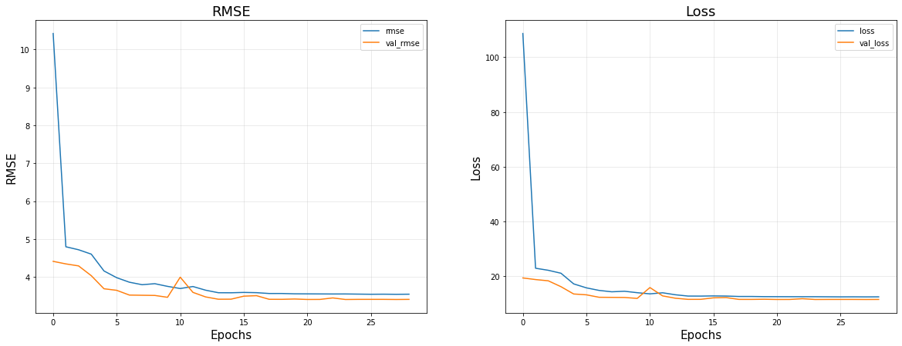

```python
import warnings
warnings.filterwarnings('ignore')
```


```python
import pandas as pd
import numpy as np
import tensorflow as tf
from keras.layers import LSTM, Dense, Dropout
from keras.models import Sequential
```


```python
pd.set_option('display.max_columns',None)
pd.set_option('display.max_rows',None)
```


```python
df=pd.read_csv("../data/MainData.csv")
df.shape
```


    (11092, 248)


```python
df.head(3)
```


<div>
<style scoped>
    .dataframe tbody tr th:only-of-type {
        vertical-align: middle;
    }

    .dataframe tbody tr th {
        vertical-align: top;
    }

    .dataframe thead th {
        text-align: right;
    }
</style>
<table border="1" class="dataframe">
  <thead>
    <tr style="text-align: right;">
      <th></th>
      <th>pid</th>
      <th>respid</th>
      <th>w01hhsize</th>
      <th>w01A002_age</th>
      <th>w01edu</th>
      <th>w01gender1</th>
      <th>w01region1</th>
      <th>w01region3</th>
      <th>w01C152</th>
      <th>w01C056</th>
      <th>w01C075</th>
      <th>w01C083</th>
      <th>w01C105</th>
      <th>w01C107</th>
      <th>w01C108</th>
      <th>w01C144</th>
      <th>w01bmi</th>
      <th>w01smoke</th>
      <th>w01iadl</th>
      <th>w01mmse</th>
      <th>w01mmseg</th>
      <th>w01chronic_a</th>
      <th>w01chronic_b</th>
      <th>w01chronic_c</th>
      <th>w01chronic_d</th>
      <th>w01chronic_e</th>
      <th>w01chronic_f</th>
      <th>w01chronic_g</th>
      <th>w01chronic_h</th>
      <th>w01chronic_i</th>
      <th>w01present_labor</th>
      <th>w02hhsize</th>
      <th>w02A002_age</th>
      <th>w02edu</th>
      <th>w02gender1</th>
      <th>w02region1</th>
      <th>w02region3</th>
      <th>w02C152</th>
      <th>w02C056</th>
      <th>w02C075</th>
      <th>w02C083</th>
      <th>w02C105</th>
      <th>w02C107</th>
      <th>w02C108</th>
      <th>w02C144</th>
      <th>w02bmi</th>
      <th>w02smoke</th>
      <th>w02alc</th>
      <th>w02adl</th>
      <th>w02iadl</th>
      <th>w02mmse</th>
      <th>w02mmseg</th>
      <th>w02chronic_a</th>
      <th>w02chronic_b</th>
      <th>w02chronic_c</th>
      <th>w02chronic_d</th>
      <th>w02chronic_e</th>
      <th>w02chronic_f</th>
      <th>w02chronic_g</th>
      <th>w02chronic_h</th>
      <th>w02chronic_i</th>
      <th>w02present_labor</th>
      <th>w03hhsize</th>
      <th>w03A002_age</th>
      <th>w03edu</th>
      <th>w03gender1</th>
      <th>w03region1</th>
      <th>w03region3</th>
      <th>w03C152</th>
      <th>w03C056</th>
      <th>w03C075</th>
      <th>w03C083</th>
      <th>w03C105</th>
      <th>w03C107</th>
      <th>w03C108</th>
      <th>w03C144</th>
      <th>w03bmi</th>
      <th>w03smoke</th>
      <th>w03alc</th>
      <th>w03adl</th>
      <th>w03iadl</th>
      <th>w03mmseg</th>
      <th>w03mmse</th>
      <th>w03chronic_a</th>
      <th>w03chronic_b</th>
      <th>w03chronic_c</th>
      <th>w03chronic_d</th>
      <th>w03chronic_e</th>
      <th>w03chronic_f</th>
      <th>w03chronic_g</th>
      <th>w03chronic_h</th>
      <th>w03chronic_i</th>
      <th>w03present_labor</th>
      <th>w04hhsize</th>
      <th>w04A002_age</th>
      <th>w04edu</th>
      <th>w04gender1</th>
      <th>w04region1</th>
      <th>w04region3</th>
      <th>w04C152</th>
      <th>w04C056</th>
      <th>w04C075</th>
      <th>w04C083</th>
      <th>w04C105</th>
      <th>w04C107</th>
      <th>w04C108</th>
      <th>w04C144</th>
      <th>w04bmi</th>
      <th>w04smoke</th>
      <th>w04alc</th>
      <th>w04adl</th>
      <th>w04iadl</th>
      <th>w04mmseg</th>
      <th>w04mmse</th>
      <th>w04chronic_a</th>
      <th>w04chronic_b</th>
      <th>w04chronic_c</th>
      <th>w04chronic_d</th>
      <th>w04chronic_e</th>
      <th>w04chronic_f</th>
      <th>w04chronic_g</th>
      <th>w04chronic_h</th>
      <th>w04chronic_i</th>
      <th>w04present_labor</th>
      <th>w05hhsize</th>
      <th>w05A002_age</th>
      <th>w05edu</th>
      <th>w05gender1</th>
      <th>w05region1</th>
      <th>w05region3</th>
      <th>w05C152</th>
      <th>w05C056</th>
      <th>w05C075</th>
      <th>w05C083</th>
      <th>w05C105</th>
      <th>w05C107</th>
      <th>w05C108</th>
      <th>w05C144</th>
      <th>w05bmi</th>
      <th>w05smoke</th>
      <th>w05alc</th>
      <th>w05adl</th>
      <th>w05iadl</th>
      <th>w05mmseg</th>
      <th>w05mmse</th>
      <th>w05chronic_a</th>
      <th>w05chronic_b</th>
      <th>w05chronic_c</th>
      <th>w05chronic_d</th>
      <th>w05chronic_e</th>
      <th>w05chronic_f</th>
      <th>w05chronic_g</th>
      <th>w05chronic_h</th>
      <th>w05chronic_i</th>
      <th>w05present_labor</th>
      <th>w06hhsize</th>
      <th>w06A002_age</th>
      <th>w06edu</th>
      <th>w06gender1</th>
      <th>w06region1</th>
      <th>w06region3</th>
      <th>w06C152</th>
      <th>w06C056</th>
      <th>w06C075</th>
      <th>w06C083</th>
      <th>w06C105</th>
      <th>w06C107</th>
      <th>w06C108</th>
      <th>w06C144</th>
      <th>w06bmi</th>
      <th>w06smoke</th>
      <th>w06alc</th>
      <th>w06adl</th>
      <th>w06iadl</th>
      <th>w06mmseg</th>
      <th>w06mmse</th>
      <th>w06chronic_a</th>
      <th>w06chronic_b</th>
      <th>w06chronic_c</th>
      <th>w06chronic_d</th>
      <th>w06chronic_e</th>
      <th>w06chronic_f</th>
      <th>w06chronic_g</th>
      <th>w06chronic_h</th>
      <th>w06chronic_i</th>
      <th>w06present_labor</th>
      <th>w07hhsize</th>
      <th>w07A002_age</th>
      <th>w07edu</th>
      <th>w07gender1</th>
      <th>w07region1</th>
      <th>w07region3</th>
      <th>w07C152</th>
      <th>w07C056</th>
      <th>w07C075</th>
      <th>w07C083</th>
      <th>w07C105</th>
      <th>w07C107</th>
      <th>w07C108</th>
      <th>w07C144</th>
      <th>w07bmi</th>
      <th>w07smoke</th>
      <th>w07alc</th>
      <th>w07adl</th>
      <th>w07iadl</th>
      <th>w07mmseg</th>
      <th>w07mmse</th>
      <th>w07chronic_a</th>
      <th>w07chronic_b</th>
      <th>w07chronic_c</th>
      <th>w07chronic_d</th>
      <th>w07chronic_e</th>
      <th>w07chronic_f</th>
      <th>w07chronic_g</th>
      <th>w07chronic_h</th>
      <th>w07chronic_i</th>
      <th>w07present_labor</th>
      <th>w08hhsize</th>
      <th>w08A002_age</th>
      <th>w08edu</th>
      <th>w08gender1</th>
      <th>w08region1</th>
      <th>w08region3</th>
      <th>w08C152</th>
      <th>w08C056</th>
      <th>w08C075</th>
      <th>w08C083</th>
      <th>w08C105</th>
      <th>w08C107</th>
      <th>w08C108</th>
      <th>w08C144</th>
      <th>w08bmi</th>
      <th>w08smoke</th>
      <th>w08alc</th>
      <th>w08adl</th>
      <th>w08iadl</th>
      <th>w08mmseg</th>
      <th>w08mmse</th>
      <th>w08chronic_a</th>
      <th>w08chronic_b</th>
      <th>w08chronic_c</th>
      <th>w08chronic_d</th>
      <th>w08chronic_e</th>
      <th>w08chronic_f</th>
      <th>w08chronic_g</th>
      <th>w08chronic_h</th>
      <th>w08chronic_i</th>
      <th>w08present_labor</th>
    </tr>
  </thead>
  <tbody>
    <tr>
      <th>0</th>
      <td>11</td>
      <td>1.0</td>
      <td>1.0</td>
      <td>73.0</td>
      <td>2.0</td>
      <td>5.0</td>
      <td>11.0</td>
      <td>1.0</td>
      <td>4.0</td>
      <td>1.0</td>
      <td>4.0</td>
      <td>2.0</td>
      <td>60.0</td>
      <td>152.0</td>
      <td>5.0</td>
      <td>1.0</td>
      <td>25.969529</td>
      <td>0.0</td>
      <td>0.0</td>
      <td>29.0</td>
      <td>3.0</td>
      <td>5.0</td>
      <td>5.0</td>
      <td>5.0</td>
      <td>5.0</td>
      <td>5.0</td>
      <td>5.0</td>
      <td>5.0</td>
      <td>5.0</td>
      <td>1.0</td>
      <td>5.0</td>
      <td>1.0</td>
      <td>75.0</td>
      <td>2.0</td>
      <td>5.0</td>
      <td>11.0</td>
      <td>1.0</td>
      <td>2.0</td>
      <td>5.0</td>
      <td>3.0</td>
      <td>2.0</td>
      <td>58.0</td>
      <td>150.0</td>
      <td>5.0</td>
      <td>1.0</td>
      <td>25.777778</td>
      <td>0.0</td>
      <td>3.0</td>
      <td>0.0</td>
      <td>0.0</td>
      <td>29.0</td>
      <td>3.0</td>
      <td>5.0</td>
      <td>5.0</td>
      <td>5.0</td>
      <td>5.0</td>
      <td>5.0</td>
      <td>5.0</td>
      <td>5.0</td>
      <td>5.0</td>
      <td>1.0</td>
      <td>5.0</td>
      <td>NaN</td>
      <td>NaN</td>
      <td>NaN</td>
      <td>NaN</td>
      <td>NaN</td>
      <td>NaN</td>
      <td>NaN</td>
      <td>NaN</td>
      <td>NaN</td>
      <td>NaN</td>
      <td>58.0</td>
      <td>150.0</td>
      <td>NaN</td>
      <td>NaN</td>
      <td>25.777778</td>
      <td>NaN</td>
      <td>NaN</td>
      <td>NaN</td>
      <td>NaN</td>
      <td>NaN</td>
      <td>NaN</td>
      <td>NaN</td>
      <td>NaN</td>
      <td>NaN</td>
      <td>NaN</td>
      <td>NaN</td>
      <td>NaN</td>
      <td>NaN</td>
      <td>NaN</td>
      <td>NaN</td>
      <td>NaN</td>
      <td>1.0</td>
      <td>79.0</td>
      <td>2.0</td>
      <td>5.0</td>
      <td>11.0</td>
      <td>1.0</td>
      <td>3.0</td>
      <td>5.0</td>
      <td>2.0</td>
      <td>2.0</td>
      <td>55.0</td>
      <td>150.0</td>
      <td>5.0</td>
      <td>2.0</td>
      <td>24.444444</td>
      <td>0.0</td>
      <td>3.0</td>
      <td>0.0</td>
      <td>0.0</td>
      <td>3.0</td>
      <td>27.0</td>
      <td>5.0</td>
      <td>5.0</td>
      <td>5.0</td>
      <td>5.0</td>
      <td>5.0</td>
      <td>5.0</td>
      <td>5.0</td>
      <td>5.0</td>
      <td>1.0</td>
      <td>5.0</td>
      <td>1.0</td>
      <td>81.0</td>
      <td>2.0</td>
      <td>5.0</td>
      <td>11.0</td>
      <td>1.0</td>
      <td>3.0</td>
      <td>1.0</td>
      <td>3.0</td>
      <td>3.0</td>
      <td>57.0</td>
      <td>150.0</td>
      <td>5.0</td>
      <td>1.0</td>
      <td>25.333333</td>
      <td>0.0</td>
      <td>3.0</td>
      <td>0.0</td>
      <td>0.0</td>
      <td>3.0</td>
      <td>25.0</td>
      <td>1.0</td>
      <td>1.0</td>
      <td>5.0</td>
      <td>5.0</td>
      <td>5.0</td>
      <td>5.0</td>
      <td>5.0</td>
      <td>5.0</td>
      <td>1.0</td>
      <td>5.0</td>
      <td>1.0</td>
      <td>83.0</td>
      <td>2.0</td>
      <td>5.0</td>
      <td>11.0</td>
      <td>1.0</td>
      <td>3.0</td>
      <td>5.0</td>
      <td>4.0</td>
      <td>2.0</td>
      <td>56.0</td>
      <td>150.0</td>
      <td>5.0</td>
      <td>1.0</td>
      <td>24.888889</td>
      <td>0.0</td>
      <td>3.0</td>
      <td>0.0</td>
      <td>0.0</td>
      <td>2.0</td>
      <td>22.0</td>
      <td>1.0</td>
      <td>1.0</td>
      <td>5.0</td>
      <td>5.0</td>
      <td>5.0</td>
      <td>5.0</td>
      <td>5.0</td>
      <td>5.0</td>
      <td>1.0</td>
      <td>5.0</td>
      <td>1.0</td>
      <td>85.0</td>
      <td>2.0</td>
      <td>5.0</td>
      <td>11.0</td>
      <td>1.0</td>
      <td>3.0</td>
      <td>5.0</td>
      <td>4.0</td>
      <td>4.0</td>
      <td>53.0</td>
      <td>150.0</td>
      <td>5.0</td>
      <td>2.0</td>
      <td>23.555556</td>
      <td>0.0</td>
      <td>3.0</td>
      <td>0.0</td>
      <td>0.0</td>
      <td>1.0</td>
      <td>15.0</td>
      <td>1.0</td>
      <td>1.0</td>
      <td>5.0</td>
      <td>5.0</td>
      <td>5.0</td>
      <td>5.0</td>
      <td>5.0</td>
      <td>5.0</td>
      <td>1.0</td>
      <td>5.0</td>
      <td>1.0</td>
      <td>87.0</td>
      <td>2.0</td>
      <td>5.0</td>
      <td>11.0</td>
      <td>1.0</td>
      <td>4.0</td>
      <td>5.0</td>
      <td>5.0</td>
      <td>4.0</td>
      <td>50.0</td>
      <td>148.0</td>
      <td>1.0</td>
      <td>2.0</td>
      <td>22.826881</td>
      <td>0.0</td>
      <td>3.0</td>
      <td>0.0</td>
      <td>6.0</td>
      <td>1.0</td>
      <td>13.0</td>
      <td>1.0</td>
      <td>1.0</td>
      <td>5.0</td>
      <td>5.0</td>
      <td>5.0</td>
      <td>5.0</td>
      <td>5.0</td>
      <td>5.0</td>
      <td>1.0</td>
      <td>5.0</td>
    </tr>
    <tr>
      <th>1</th>
      <td>21</td>
      <td>1.0</td>
      <td>2.0</td>
      <td>51.0</td>
      <td>4.0</td>
      <td>5.0</td>
      <td>11.0</td>
      <td>1.0</td>
      <td>2.0</td>
      <td>5.0</td>
      <td>2.0</td>
      <td>2.0</td>
      <td>59.0</td>
      <td>158.0</td>
      <td>5.0</td>
      <td>1.0</td>
      <td>23.634033</td>
      <td>0.0</td>
      <td>0.0</td>
      <td>30.0</td>
      <td>3.0</td>
      <td>5.0</td>
      <td>5.0</td>
      <td>5.0</td>
      <td>5.0</td>
      <td>5.0</td>
      <td>5.0</td>
      <td>5.0</td>
      <td>5.0</td>
      <td>5.0</td>
      <td>5.0</td>
      <td>4.0</td>
      <td>53.0</td>
      <td>4.0</td>
      <td>5.0</td>
      <td>11.0</td>
      <td>1.0</td>
      <td>3.0</td>
      <td>5.0</td>
      <td>3.0</td>
      <td>2.0</td>
      <td>65.0</td>
      <td>158.0</td>
      <td>1.0</td>
      <td>2.0</td>
      <td>26.037494</td>
      <td>0.0</td>
      <td>3.0</td>
      <td>0.0</td>
      <td>0.0</td>
      <td>29.0</td>
      <td>3.0</td>
      <td>5.0</td>
      <td>5.0</td>
      <td>5.0</td>
      <td>5.0</td>
      <td>5.0</td>
      <td>5.0</td>
      <td>5.0</td>
      <td>5.0</td>
      <td>5.0</td>
      <td>5.0</td>
      <td>4.0</td>
      <td>55.0</td>
      <td>4.0</td>
      <td>5.0</td>
      <td>11.0</td>
      <td>1.0</td>
      <td>3.0</td>
      <td>5.0</td>
      <td>3.0</td>
      <td>2.0</td>
      <td>62.0</td>
      <td>159.0</td>
      <td>1.0</td>
      <td>1.0</td>
      <td>24.524346</td>
      <td>0.0</td>
      <td>3.0</td>
      <td>0.0</td>
      <td>0.0</td>
      <td>3.0</td>
      <td>30.0</td>
      <td>5.0</td>
      <td>5.0</td>
      <td>5.0</td>
      <td>5.0</td>
      <td>5.0</td>
      <td>5.0</td>
      <td>5.0</td>
      <td>5.0</td>
      <td>5.0</td>
      <td>1.0</td>
      <td>4.0</td>
      <td>57.0</td>
      <td>4.0</td>
      <td>5.0</td>
      <td>11.0</td>
      <td>1.0</td>
      <td>2.0</td>
      <td>5.0</td>
      <td>3.0</td>
      <td>2.0</td>
      <td>63.0</td>
      <td>158.0</td>
      <td>1.0</td>
      <td>1.0</td>
      <td>25.236340</td>
      <td>0.0</td>
      <td>3.0</td>
      <td>0.0</td>
      <td>0.0</td>
      <td>3.0</td>
      <td>30.0</td>
      <td>5.0</td>
      <td>5.0</td>
      <td>5.0</td>
      <td>5.0</td>
      <td>5.0</td>
      <td>5.0</td>
      <td>5.0</td>
      <td>5.0</td>
      <td>5.0</td>
      <td>5.0</td>
      <td>2.0</td>
      <td>59.0</td>
      <td>4.0</td>
      <td>5.0</td>
      <td>11.0</td>
      <td>1.0</td>
      <td>3.0</td>
      <td>5.0</td>
      <td>3.0</td>
      <td>2.0</td>
      <td>60.0</td>
      <td>158.0</td>
      <td>5.0</td>
      <td>1.0</td>
      <td>24.034610</td>
      <td>0.0</td>
      <td>3.0</td>
      <td>0.0</td>
      <td>0.0</td>
      <td>3.0</td>
      <td>27.0</td>
      <td>5.0</td>
      <td>1.0</td>
      <td>5.0</td>
      <td>5.0</td>
      <td>5.0</td>
      <td>5.0</td>
      <td>5.0</td>
      <td>5.0</td>
      <td>1.0</td>
      <td>5.0</td>
      <td>2.0</td>
      <td>61.0</td>
      <td>4.0</td>
      <td>5.0</td>
      <td>11.0</td>
      <td>1.0</td>
      <td>3.0</td>
      <td>5.0</td>
      <td>2.0</td>
      <td>2.0</td>
      <td>63.0</td>
      <td>158.0</td>
      <td>5.0</td>
      <td>1.0</td>
      <td>25.236340</td>
      <td>0.0</td>
      <td>3.0</td>
      <td>0.0</td>
      <td>0.0</td>
      <td>3.0</td>
      <td>29.0</td>
      <td>5.0</td>
      <td>1.0</td>
      <td>5.0</td>
      <td>5.0</td>
      <td>5.0</td>
      <td>5.0</td>
      <td>5.0</td>
      <td>5.0</td>
      <td>1.0</td>
      <td>1.0</td>
      <td>2.0</td>
      <td>63.0</td>
      <td>4.0</td>
      <td>5.0</td>
      <td>11.0</td>
      <td>1.0</td>
      <td>2.0</td>
      <td>5.0</td>
      <td>3.0</td>
      <td>3.0</td>
      <td>63.0</td>
      <td>158.0</td>
      <td>5.0</td>
      <td>1.0</td>
      <td>25.236340</td>
      <td>0.0</td>
      <td>3.0</td>
      <td>0.0</td>
      <td>0.0</td>
      <td>2.0</td>
      <td>23.0</td>
      <td>5.0</td>
      <td>1.0</td>
      <td>5.0</td>
      <td>5.0</td>
      <td>5.0</td>
      <td>5.0</td>
      <td>5.0</td>
      <td>5.0</td>
      <td>1.0</td>
      <td>5.0</td>
      <td>4.0</td>
      <td>65.0</td>
      <td>4.0</td>
      <td>5.0</td>
      <td>11.0</td>
      <td>1.0</td>
      <td>2.0</td>
      <td>5.0</td>
      <td>4.0</td>
      <td>3.0</td>
      <td>62.0</td>
      <td>158.0</td>
      <td>5.0</td>
      <td>1.0</td>
      <td>24.835763</td>
      <td>0.0</td>
      <td>3.0</td>
      <td>0.0</td>
      <td>0.0</td>
      <td>3.0</td>
      <td>25.0</td>
      <td>5.0</td>
      <td>1.0</td>
      <td>5.0</td>
      <td>5.0</td>
      <td>5.0</td>
      <td>5.0</td>
      <td>5.0</td>
      <td>5.0</td>
      <td>1.0</td>
      <td>5.0</td>
    </tr>
    <tr>
      <th>2</th>
      <td>22</td>
      <td>2.0</td>
      <td>2.0</td>
      <td>52.0</td>
      <td>4.0</td>
      <td>1.0</td>
      <td>11.0</td>
      <td>1.0</td>
      <td>2.0</td>
      <td>5.0</td>
      <td>2.0</td>
      <td>2.0</td>
      <td>72.0</td>
      <td>168.0</td>
      <td>1.0</td>
      <td>1.0</td>
      <td>25.510204</td>
      <td>2.0</td>
      <td>0.0</td>
      <td>29.0</td>
      <td>3.0</td>
      <td>5.0</td>
      <td>5.0</td>
      <td>5.0</td>
      <td>5.0</td>
      <td>5.0</td>
      <td>5.0</td>
      <td>5.0</td>
      <td>5.0</td>
      <td>5.0</td>
      <td>1.0</td>
      <td>4.0</td>
      <td>54.0</td>
      <td>4.0</td>
      <td>1.0</td>
      <td>11.0</td>
      <td>1.0</td>
      <td>2.0</td>
      <td>5.0</td>
      <td>3.0</td>
      <td>1.0</td>
      <td>63.0</td>
      <td>174.0</td>
      <td>1.0</td>
      <td>1.0</td>
      <td>20.808561</td>
      <td>1.0</td>
      <td>1.0</td>
      <td>0.0</td>
      <td>0.0</td>
      <td>29.0</td>
      <td>3.0</td>
      <td>5.0</td>
      <td>5.0</td>
      <td>5.0</td>
      <td>5.0</td>
      <td>5.0</td>
      <td>5.0</td>
      <td>5.0</td>
      <td>5.0</td>
      <td>5.0</td>
      <td>1.0</td>
      <td>4.0</td>
      <td>56.0</td>
      <td>4.0</td>
      <td>1.0</td>
      <td>11.0</td>
      <td>1.0</td>
      <td>3.0</td>
      <td>5.0</td>
      <td>3.0</td>
      <td>2.0</td>
      <td>63.0</td>
      <td>174.0</td>
      <td>5.0</td>
      <td>1.0</td>
      <td>20.808561</td>
      <td>1.0</td>
      <td>1.0</td>
      <td>0.0</td>
      <td>0.0</td>
      <td>3.0</td>
      <td>30.0</td>
      <td>5.0</td>
      <td>5.0</td>
      <td>5.0</td>
      <td>5.0</td>
      <td>5.0</td>
      <td>5.0</td>
      <td>5.0</td>
      <td>5.0</td>
      <td>5.0</td>
      <td>1.0</td>
      <td>4.0</td>
      <td>58.0</td>
      <td>4.0</td>
      <td>1.0</td>
      <td>11.0</td>
      <td>1.0</td>
      <td>2.0</td>
      <td>5.0</td>
      <td>3.0</td>
      <td>2.0</td>
      <td>63.0</td>
      <td>174.0</td>
      <td>5.0</td>
      <td>1.0</td>
      <td>20.808561</td>
      <td>1.0</td>
      <td>1.0</td>
      <td>0.0</td>
      <td>0.0</td>
      <td>3.0</td>
      <td>30.0</td>
      <td>5.0</td>
      <td>5.0</td>
      <td>5.0</td>
      <td>5.0</td>
      <td>5.0</td>
      <td>5.0</td>
      <td>5.0</td>
      <td>5.0</td>
      <td>5.0</td>
      <td>1.0</td>
      <td>2.0</td>
      <td>60.0</td>
      <td>4.0</td>
      <td>1.0</td>
      <td>11.0</td>
      <td>1.0</td>
      <td>2.0</td>
      <td>5.0</td>
      <td>2.0</td>
      <td>2.0</td>
      <td>62.0</td>
      <td>174.0</td>
      <td>5.0</td>
      <td>1.0</td>
      <td>20.478267</td>
      <td>1.0</td>
      <td>1.0</td>
      <td>0.0</td>
      <td>0.0</td>
      <td>3.0</td>
      <td>30.0</td>
      <td>5.0</td>
      <td>5.0</td>
      <td>5.0</td>
      <td>5.0</td>
      <td>5.0</td>
      <td>5.0</td>
      <td>5.0</td>
      <td>5.0</td>
      <td>5.0</td>
      <td>1.0</td>
      <td>2.0</td>
      <td>62.0</td>
      <td>4.0</td>
      <td>1.0</td>
      <td>11.0</td>
      <td>1.0</td>
      <td>2.0</td>
      <td>5.0</td>
      <td>2.0</td>
      <td>2.0</td>
      <td>63.0</td>
      <td>174.0</td>
      <td>1.0</td>
      <td>1.0</td>
      <td>20.808561</td>
      <td>1.0</td>
      <td>1.0</td>
      <td>0.0</td>
      <td>0.0</td>
      <td>3.0</td>
      <td>28.0</td>
      <td>5.0</td>
      <td>5.0</td>
      <td>5.0</td>
      <td>5.0</td>
      <td>5.0</td>
      <td>5.0</td>
      <td>5.0</td>
      <td>5.0</td>
      <td>5.0</td>
      <td>1.0</td>
      <td>2.0</td>
      <td>64.0</td>
      <td>4.0</td>
      <td>1.0</td>
      <td>11.0</td>
      <td>1.0</td>
      <td>2.0</td>
      <td>5.0</td>
      <td>3.0</td>
      <td>5.0</td>
      <td>64.0</td>
      <td>174.0</td>
      <td>1.0</td>
      <td>1.0</td>
      <td>21.138856</td>
      <td>1.0</td>
      <td>1.0</td>
      <td>0.0</td>
      <td>0.0</td>
      <td>2.0</td>
      <td>23.0</td>
      <td>5.0</td>
      <td>5.0</td>
      <td>5.0</td>
      <td>5.0</td>
      <td>5.0</td>
      <td>5.0</td>
      <td>5.0</td>
      <td>5.0</td>
      <td>5.0</td>
      <td>1.0</td>
      <td>4.0</td>
      <td>66.0</td>
      <td>4.0</td>
      <td>1.0</td>
      <td>11.0</td>
      <td>1.0</td>
      <td>3.0</td>
      <td>5.0</td>
      <td>3.0</td>
      <td>3.0</td>
      <td>64.0</td>
      <td>174.0</td>
      <td>1.0</td>
      <td>1.0</td>
      <td>21.138856</td>
      <td>1.0</td>
      <td>1.0</td>
      <td>0.0</td>
      <td>0.0</td>
      <td>2.0</td>
      <td>22.0</td>
      <td>5.0</td>
      <td>5.0</td>
      <td>5.0</td>
      <td>5.0</td>
      <td>5.0</td>
      <td>5.0</td>
      <td>5.0</td>
      <td>5.0</td>
      <td>5.0</td>
      <td>1.0</td>
    </tr>
  </tbody>
</table>
</div>


```python
df1=df.loc[:,'w01hhsize':'w01present_labor']
df2=df.loc[:,'w02hhsize':'w02present_labor']
df3=df.loc[:,'w03hhsize':'w03present_labor']
df4=df.loc[:,'w04hhsize':'w04present_labor']
df5=df.loc[:,'w05hhsize':'w05present_labor']
df6=df.loc[:,'w06hhsize':'w06present_labor']
df7=df.loc[:,'w07hhsize':'w07present_labor']
df8=df.loc[:,'w08hhsize':'w08present_labor']
```


```python
# 1차 설문조사에 alc 과  adl점수가 없음. --> 2차~8차 데이터만 사용
print(df1.shape,df2.shape,df3.shape,df4.shape,df5.shape,df6.shape,df7.shape,df8.shape)
```

    (11092, 29) (11092, 31) (11092, 31) (11092, 31) (11092, 31) (11092, 31) (11092, 31) (11092, 31)


```python
# 여기서 11092 명 -> 4128 은 2차 ~ 8차 까지의 설문데이터가 모두 있는 경우를 의미함.
df=pd.concat([df2,df3,df4,df5,df6,df7,df8],axis=1).dropna(axis=0)
df.shape
```


    (4128, 217)


```python
# 제거 할 변수 추가 < region1, 낙상, adl ,iadl, 악력 > 제거
y=df['w08mmse']
X=df[df.columns.drop(list(df.filter(regex=r'(region1|adl|C056|mmse)')))]
print(X.shape,y.shape)
```

    (4128, 175) (4128,)


```python
from sklearn.preprocessing import MinMaxScaler

sc=MinMaxScaler()

X=pd.DataFrame(sc.fit_transform(X))
```


```python
# Array 를 (Size, Time, Dimension)의 tensor로 변환
X=X.values.reshape(X.shape[0],7,-1)
print(X.shape,y.shape) # (size,timestep,feature)
```

    (4128, 7, 25) (4128,)


```python
# Train Test Set 으로 Split 하자
from sklearn.model_selection import train_test_split

X_train, X_test, y_train, y_test = train_test_split(X,y,test_size=0.2,stratify=y, random_state=42)
```


```python
print(X_train.shape,X_test.shape)
```

    (3302, 7, 25) (826, 7, 25)


# LSTM Many-to-one


```python
# LSTM many-to-one 구현
model = Sequential() # Sequeatial Model
model.add(LSTM(24, input_shape=(7, 25),return_sequences=False)) # (timestep, feature)
model.add(Dense(10,activation='relu'))
model.add(Dense(1)) # output = 1
model.compile(optimizer='adam', loss='mse', metrics=[tf.keras.metrics.RootMeanSquaredError()])

model.summary()
```

    Model: "sequential_8"
    _________________________________________________________________
     Layer (type)                Output Shape              Param #   
    =================================================================
     lstm_12 (LSTM)              (None, 24)                4800      
                                                                     
     dense_22 (Dense)            (None, 10)                250       
                                                                     
     dense_23 (Dense)            (None, 1)                 11        
                                                                     
    =================================================================
    Total params: 5,061
    Trainable params: 5,061
    Non-trainable params: 0
    _________________________________________________________________


```python
from tensorflow.keras.callbacks import EarlyStopping, ModelCheckpoint, ReduceLROnPlateau

es = EarlyStopping(monitor='val_loss', mode='min', verbose=1, patience=5)
mc = ModelCheckpoint("lstm.h5", save_best_only=True)
rlr = ReduceLROnPlateau(factor=0.2, patience=3)

# fit model
history = model.fit(X_train, y_train, batch_size=16, validation_split=0.2, epochs=50,callbacks=[es,mc,rlr])
```

    Epoch 1/50


    2023-01-13 17:33:21.062850: I tensorflow/core/grappler/optimizers/custom_graph_optimizer_registry.cc:113] Plugin optimizer for device_type GPU is enabled.
    2023-01-13 17:33:21.173249: I tensorflow/core/grappler/optimizers/custom_graph_optimizer_registry.cc:113] Plugin optimizer for device_type GPU is enabled.
    2023-01-13 17:33:21.252890: I tensorflow/core/grappler/optimizers/custom_graph_optimizer_registry.cc:113] Plugin optimizer for device_type GPU is enabled.


    166/166 [==============================] - ETA: 0s - loss: 247.9324 - root_mean_squared_error: 15.7459

    2023-01-13 17:33:22.861085: I tensorflow/core/grappler/optimizers/custom_graph_optimizer_registry.cc:113] Plugin optimizer for device_type GPU is enabled.
    2023-01-13 17:33:22.902916: I tensorflow/core/grappler/optimizers/custom_graph_optimizer_registry.cc:113] Plugin optimizer for device_type GPU is enabled.


    166/166 [==============================] - 3s 11ms/step - loss: 247.9324 - root_mean_squared_error: 15.7459 - val_loss: 39.4683 - val_root_mean_squared_error: 6.2824 - lr: 0.0010
    Epoch 2/50
    166/166 [==============================] - 1s 9ms/step - loss: 29.3166 - root_mean_squared_error: 5.4145 - val_loss: 30.8295 - val_root_mean_squared_error: 5.5524 - lr: 0.0010
    Epoch 3/50
    166/166 [==============================] - 2s 9ms/step - loss: 28.3507 - root_mean_squared_error: 5.3245 - val_loss: 30.6935 - val_root_mean_squared_error: 5.5402 - lr: 0.0010
    Epoch 4/50
    166/166 [==============================] - 1s 9ms/step - loss: 27.4802 - root_mean_squared_error: 5.2422 - val_loss: 26.7408 - val_root_mean_squared_error: 5.1712 - lr: 0.0010
    Epoch 5/50
    166/166 [==============================] - 2s 9ms/step - loss: 23.2907 - root_mean_squared_error: 4.8260 - val_loss: 22.2622 - val_root_mean_squared_error: 4.7183 - lr: 0.0010
    Epoch 6/50
    166/166 [==============================] - 2s 9ms/step - loss: 19.6294 - root_mean_squared_error: 4.4305 - val_loss: 20.5708 - val_root_mean_squared_error: 4.5355 - lr: 0.0010
    Epoch 7/50
    166/166 [==============================] - 2s 9ms/step - loss: 18.9543 - root_mean_squared_error: 4.3537 - val_loss: 18.0502 - val_root_mean_squared_error: 4.2485 - lr: 0.0010
    Epoch 8/50
    166/166 [==============================] - 1s 9ms/step - loss: 16.8190 - root_mean_squared_error: 4.1011 - val_loss: 17.2706 - val_root_mean_squared_error: 4.1558 - lr: 0.0010
    Epoch 9/50
    166/166 [==============================] - 1s 9ms/step - loss: 16.4683 - root_mean_squared_error: 4.0581 - val_loss: 17.1991 - val_root_mean_squared_error: 4.1472 - lr: 0.0010
    Epoch 10/50
    166/166 [==============================] - 2s 9ms/step - loss: 15.8923 - root_mean_squared_error: 3.9865 - val_loss: 17.1075 - val_root_mean_squared_error: 4.1361 - lr: 0.0010
    Epoch 11/50
    166/166 [==============================] - 1s 9ms/step - loss: 15.6218 - root_mean_squared_error: 3.9524 - val_loss: 17.4934 - val_root_mean_squared_error: 4.1825 - lr: 0.0010
    Epoch 12/50
    166/166 [==============================] - 1s 9ms/step - loss: 15.4657 - root_mean_squared_error: 3.9326 - val_loss: 16.2710 - val_root_mean_squared_error: 4.0337 - lr: 0.0010
    Epoch 13/50
    166/166 [==============================] - 2s 9ms/step - loss: 15.1714 - root_mean_squared_error: 3.8950 - val_loss: 16.0401 - val_root_mean_squared_error: 4.0050 - lr: 0.0010
    Epoch 14/50
    166/166 [==============================] - 2s 9ms/step - loss: 15.3510 - root_mean_squared_error: 3.9180 - val_loss: 15.9869 - val_root_mean_squared_error: 3.9984 - lr: 0.0010
    Epoch 15/50
    166/166 [==============================] - 2s 9ms/step - loss: 15.1790 - root_mean_squared_error: 3.8960 - val_loss: 17.5676 - val_root_mean_squared_error: 4.1914 - lr: 0.0010
    Epoch 16/50
    166/166 [==============================] - 1s 9ms/step - loss: 14.9542 - root_mean_squared_error: 3.8671 - val_loss: 16.6796 - val_root_mean_squared_error: 4.0841 - lr: 0.0010
    Epoch 17/50
    166/166 [==============================] - 1s 9ms/step - loss: 14.6377 - root_mean_squared_error: 3.8259 - val_loss: 15.8214 - val_root_mean_squared_error: 3.9776 - lr: 0.0010
    Epoch 18/50
    166/166 [==============================] - 1s 9ms/step - loss: 14.7494 - root_mean_squared_error: 3.8405 - val_loss: 16.5231 - val_root_mean_squared_error: 4.0649 - lr: 0.0010
    Epoch 19/50
    166/166 [==============================] - 1s 9ms/step - loss: 14.6062 - root_mean_squared_error: 3.8218 - val_loss: 16.3069 - val_root_mean_squared_error: 4.0382 - lr: 0.0010
    Epoch 20/50
    166/166 [==============================] - 1s 9ms/step - loss: 14.7448 - root_mean_squared_error: 3.8399 - val_loss: 16.0275 - val_root_mean_squared_error: 4.0034 - lr: 0.0010
    Epoch 21/50
    166/166 [==============================] - 1s 9ms/step - loss: 14.1643 - root_mean_squared_error: 3.7636 - val_loss: 15.6857 - val_root_mean_squared_error: 3.9605 - lr: 2.0000e-04
    Epoch 22/50
    166/166 [==============================] - 1s 9ms/step - loss: 14.1487 - root_mean_squared_error: 3.7615 - val_loss: 15.7828 - val_root_mean_squared_error: 3.9728 - lr: 2.0000e-04
    Epoch 23/50
    166/166 [==============================] - 2s 9ms/step - loss: 14.0551 - root_mean_squared_error: 3.7490 - val_loss: 15.7861 - val_root_mean_squared_error: 3.9732 - lr: 2.0000e-04
    Epoch 24/50
    166/166 [==============================] - 2s 9ms/step - loss: 13.9918 - root_mean_squared_error: 3.7406 - val_loss: 15.8091 - val_root_mean_squared_error: 3.9761 - lr: 2.0000e-04
    Epoch 25/50
    166/166 [==============================] - 2s 9ms/step - loss: 13.9036 - root_mean_squared_error: 3.7288 - val_loss: 15.7879 - val_root_mean_squared_error: 3.9734 - lr: 4.0000e-05
    Epoch 26/50
    166/166 [==============================] - 2s 9ms/step - loss: 13.8804 - root_mean_squared_error: 3.7256 - val_loss: 15.7947 - val_root_mean_squared_error: 3.9743 - lr: 4.0000e-05
    Epoch 26: early stopping


```python
import matplotlib.pyplot as plt
def plot_history(history):
    fig = plt.figure(figsize=(20,7))
    fig.add_subplot(121)

    # Accuracy
    plt.plot(history.epoch, history.history['root_mean_squared_error'], label = "rmse")
    plt.plot(history.epoch, history.history['val_root_mean_squared_error'], label = "val_rmse")

    plt.title("RMSE", fontsize=18)
    plt.xlabel("Epochs", fontsize=15)
    plt.ylabel("RMSE", fontsize=15)
    plt.grid(alpha=0.3)
    plt.legend()


    #Adding Subplot 1 (For Loss)
    fig.add_subplot(122)

    plt.plot(history.epoch, history.history['loss'], label="loss")
    plt.plot(history.epoch, history.history['val_loss'], label="val_loss")

    plt.title("Loss", fontsize=18)
    plt.xlabel("Epochs", fontsize=15)
    plt.ylabel("Loss", fontsize=15)
    plt.grid(alpha=0.3)
    plt.legend()

    plt.show()
    
plot_history(history)
```


    

    


```python
y_pred=model.predict(X_test)
y_pred.shape
```

    26/26 [==============================] - 0s 4ms/step


    2023-01-13 17:34:38.697217: I tensorflow/core/grappler/optimizers/custom_graph_optimizer_registry.cc:113] Plugin optimizer for device_type GPU is enabled.
    2023-01-13 17:34:38.732286: I tensorflow/core/grappler/optimizers/custom_graph_optimizer_registry.cc:113] Plugin optimizer for device_type GPU is enabled.


    (826, 1)


```python
import numpy as np
from sklearn.metrics import mean_squared_error

np.sqrt(mean_squared_error(y_test, y_pred))
```


    3.929185713482305


# LSTM Many to Many


```python
# LSTM 2차 부터 8차까지 MMSE,MMSEG 를 제외한 데이터 만들기 2차~8차 MMSE 점수가 Target 변수
df=pd.read_csv("../data/MainData.csv")
df=df[df.columns.drop(list(df.filter(regex=r'(region1|adl|C056)')))]
df1=df.loc[:,'w01hhsize':'w01present_labor']
df2=df.loc[:,'w02hhsize':'w02present_labor']
df3=df.loc[:,'w03hhsize':'w03present_labor']
df4=df.loc[:,'w04hhsize':'w04present_labor']
df5=df.loc[:,'w05hhsize':'w05present_labor']
df6=df.loc[:,'w06hhsize':'w06present_labor']
df7=df.loc[:,'w07hhsize':'w07present_labor']
df8=df.loc[:,'w08hhsize':'w08present_labor']

df_new=pd.concat([df2,df3,df4,df5,df6,df7,df8],axis=1).dropna(axis=0)

X=df_new.drop(['w02mmse','w02mmseg','w03mmse','w03mmseg','w04mmse','w04mmseg','w05mmse','w05mmseg','w06mmse','w06mmseg','w07mmse','w07mmseg','w08mmse','w08mmseg'],axis=1)
y=df_new[['w02mmse','w03mmse','w04mmse','w05mmse','w06mmse','w07mmse','w08mmse']]

from sklearn.preprocessing import MinMaxScaler

sc=MinMaxScaler()

X=pd.DataFrame(sc.fit_transform(X))

X=X.values.reshape(X.shape[0],7,-1)

# Train Test Set 으로 Split 하자
from sklearn.model_selection import train_test_split

X_train, X_test, y_train, y_test = train_test_split(X,y,test_size=0.2, random_state=42)
```


```python
print(X_train.shape,X_test.shape,y_train.shape,y_test.shape)
```

    (3302, 7, 25) (826, 7, 25) (3302, 7) (826, 7)


```python
# LSTM many-to-many Hyperparameter Tuning
model2 = Sequential() # Sequeatial Model
model2.add(LSTM(128, input_shape=(7, 25),return_sequences=True)) # (timestep, feature)
model2.add(Dropout(0.2))
model2.add(LSTM(128,return_sequences=True))
model2.add(Dropout(0.2))
model2.add(Dense(64,activation='relu'))
model2.add(Dense(16,activation='relu'))
model2.add(Dense(8,activation='relu'))
model2.add(Dense(1)) # output = 1
model2.compile(optimizer='adam', loss='mse', metrics=[tf.keras.metrics.RootMeanSquaredError()])

model2.summary()
```

    Model: "sequential_7"
    _________________________________________________________________
     Layer (type)                Output Shape              Param #   
    =================================================================
     lstm_10 (LSTM)              (None, 7, 128)            78848     
                                                                     
     dropout_6 (Dropout)         (None, 7, 128)            0         
                                                                     
     lstm_11 (LSTM)              (None, 7, 128)            131584    
                                                                     
     dropout_7 (Dropout)         (None, 7, 128)            0         
                                                                     
     dense_18 (Dense)            (None, 7, 64)             8256      
                                                                     
     dense_19 (Dense)            (None, 7, 16)             1040      
                                                                     
     dense_20 (Dense)            (None, 7, 8)              136       
                                                                     
     dense_21 (Dense)            (None, 7, 1)              9         
                                                                     
    =================================================================
    Total params: 219,873
    Trainable params: 219,873
    Non-trainable params: 0
    _________________________________________________________________


```python
es = EarlyStopping(monitor='val_loss', mode='min', verbose=0, patience=5)
mc = ModelCheckpoint("lstm.h5", save_best_only=True)
rlr = ReduceLROnPlateau(factor=0.2, patience=3)

# fit model
history = model2.fit(X_train, y_train, batch_size=16, validation_split=0.2, epochs=50,callbacks=[es,mc,rlr])
```

    Epoch 1/50


    2023-01-13 17:30:08.372120: I tensorflow/core/grappler/optimizers/custom_graph_optimizer_registry.cc:113] Plugin optimizer for device_type GPU is enabled.
    2023-01-13 17:30:08.586791: I tensorflow/core/grappler/optimizers/custom_graph_optimizer_registry.cc:113] Plugin optimizer for device_type GPU is enabled.
    2023-01-13 17:30:08.636703: I tensorflow/core/grappler/optimizers/custom_graph_optimizer_registry.cc:113] Plugin optimizer for device_type GPU is enabled.
    2023-01-13 17:30:08.759107: I tensorflow/core/grappler/optimizers/custom_graph_optimizer_registry.cc:113] Plugin optimizer for device_type GPU is enabled.


      4/166 [..............................] - ETA: 4s - loss: 681.8701 - root_mean_squared_error: 26.1126  

    2023-01-13 17:30:08.830514: I tensorflow/core/grappler/optimizers/custom_graph_optimizer_registry.cc:113] Plugin optimizer for device_type GPU is enabled.


    166/166 [==============================] - ETA: 0s - loss: 108.6349 - root_mean_squared_error: 10.4228

    2023-01-13 17:30:12.328127: I tensorflow/core/grappler/optimizers/custom_graph_optimizer_registry.cc:113] Plugin optimizer for device_type GPU is enabled.
    2023-01-13 17:30:12.406372: I tensorflow/core/grappler/optimizers/custom_graph_optimizer_registry.cc:113] Plugin optimizer for device_type GPU is enabled.
    2023-01-13 17:30:12.438920: I tensorflow/core/grappler/optimizers/custom_graph_optimizer_registry.cc:113] Plugin optimizer for device_type GPU is enabled.


    166/166 [==============================] - 6s 25ms/step - loss: 108.6349 - root_mean_squared_error: 10.4228 - val_loss: 19.4415 - val_root_mean_squared_error: 4.4092 - lr: 0.0010
    Epoch 2/50
    166/166 [==============================] - 3s 21ms/step - loss: 22.9811 - root_mean_squared_error: 4.7939 - val_loss: 18.8485 - val_root_mean_squared_error: 4.3415 - lr: 0.0010
    Epoch 3/50
    166/166 [==============================] - 3s 21ms/step - loss: 22.2328 - root_mean_squared_error: 4.7152 - val_loss: 18.3952 - val_root_mean_squared_error: 4.2890 - lr: 0.0010
    Epoch 4/50
    166/166 [==============================] - 3s 21ms/step - loss: 21.1542 - root_mean_squared_error: 4.5994 - val_loss: 16.2497 - val_root_mean_squared_error: 4.0311 - lr: 0.0010
    Epoch 5/50
    166/166 [==============================] - 3s 20ms/step - loss: 17.2688 - root_mean_squared_error: 4.1556 - val_loss: 13.5836 - val_root_mean_squared_error: 3.6856 - lr: 0.0010
    Epoch 6/50
    166/166 [==============================] - 3s 20ms/step - loss: 15.8234 - root_mean_squared_error: 3.9779 - val_loss: 13.2808 - val_root_mean_squared_error: 3.6443 - lr: 0.0010
    Epoch 7/50
    166/166 [==============================] - 3s 20ms/step - loss: 14.8869 - root_mean_squared_error: 3.8584 - val_loss: 12.3842 - val_root_mean_squared_error: 3.5191 - lr: 0.0010
    Epoch 8/50
    166/166 [==============================] - 3s 21ms/step - loss: 14.3834 - root_mean_squared_error: 3.7925 - val_loss: 12.3480 - val_root_mean_squared_error: 3.5140 - lr: 0.0010
    Epoch 9/50
    166/166 [==============================] - 3s 21ms/step - loss: 14.5863 - root_mean_squared_error: 3.8192 - val_loss: 12.3139 - val_root_mean_squared_error: 3.5091 - lr: 0.0010
    Epoch 10/50
    166/166 [==============================] - 3s 21ms/step - loss: 14.0529 - root_mean_squared_error: 3.7487 - val_loss: 11.9729 - val_root_mean_squared_error: 3.4602 - lr: 0.0010
    Epoch 11/50
    166/166 [==============================] - 3s 20ms/step - loss: 13.6309 - root_mean_squared_error: 3.6920 - val_loss: 15.9307 - val_root_mean_squared_error: 3.9913 - lr: 0.0010
    Epoch 12/50
    166/166 [==============================] - 3s 21ms/step - loss: 14.0229 - root_mean_squared_error: 3.7447 - val_loss: 12.8887 - val_root_mean_squared_error: 3.5901 - lr: 0.0010
    Epoch 13/50
    166/166 [==============================] - 3s 21ms/step - loss: 13.3047 - root_mean_squared_error: 3.6476 - val_loss: 12.0389 - val_root_mean_squared_error: 3.4697 - lr: 0.0010
    Epoch 14/50
    166/166 [==============================] - 3s 21ms/step - loss: 12.8232 - root_mean_squared_error: 3.5810 - val_loss: 11.6237 - val_root_mean_squared_error: 3.4094 - lr: 2.0000e-04
    Epoch 15/50
    166/166 [==============================] - 3s 20ms/step - loss: 12.8131 - root_mean_squared_error: 3.5795 - val_loss: 11.6328 - val_root_mean_squared_error: 3.4107 - lr: 2.0000e-04
    Epoch 16/50
    166/166 [==============================] - 3s 21ms/step - loss: 12.8795 - root_mean_squared_error: 3.5888 - val_loss: 12.1801 - val_root_mean_squared_error: 3.4900 - lr: 2.0000e-04
    Epoch 17/50
    166/166 [==============================] - 3s 21ms/step - loss: 12.8329 - root_mean_squared_error: 3.5823 - val_loss: 12.2719 - val_root_mean_squared_error: 3.5031 - lr: 2.0000e-04
    Epoch 18/50
    166/166 [==============================] - 3s 20ms/step - loss: 12.6768 - root_mean_squared_error: 3.5604 - val_loss: 11.6103 - val_root_mean_squared_error: 3.4074 - lr: 4.0000e-05
    Epoch 19/50
    166/166 [==============================] - 3s 21ms/step - loss: 12.6777 - root_mean_squared_error: 3.5606 - val_loss: 11.6058 - val_root_mean_squared_error: 3.4067 - lr: 4.0000e-05
    Epoch 20/50
    166/166 [==============================] - 3s 20ms/step - loss: 12.6168 - root_mean_squared_error: 3.5520 - val_loss: 11.6638 - val_root_mean_squared_error: 3.4152 - lr: 4.0000e-05
    Epoch 21/50
    166/166 [==============================] - 3s 21ms/step - loss: 12.6051 - root_mean_squared_error: 3.5504 - val_loss: 11.5817 - val_root_mean_squared_error: 3.4032 - lr: 4.0000e-05
    Epoch 22/50
    166/166 [==============================] - 3s 21ms/step - loss: 12.5936 - root_mean_squared_error: 3.5487 - val_loss: 11.5899 - val_root_mean_squared_error: 3.4044 - lr: 4.0000e-05
    Epoch 23/50
    166/166 [==============================] - 3s 21ms/step - loss: 12.5841 - root_mean_squared_error: 3.5474 - val_loss: 11.8586 - val_root_mean_squared_error: 3.4436 - lr: 4.0000e-05
    Epoch 24/50
    166/166 [==============================] - 3s 21ms/step - loss: 12.5893 - root_mean_squared_error: 3.5481 - val_loss: 11.5765 - val_root_mean_squared_error: 3.4024 - lr: 4.0000e-05
    Epoch 25/50
    166/166 [==============================] - 3s 20ms/step - loss: 12.5604 - root_mean_squared_error: 3.5441 - val_loss: 11.5974 - val_root_mean_squared_error: 3.4055 - lr: 4.0000e-05
    Epoch 26/50
    166/166 [==============================] - 3s 20ms/step - loss: 12.5332 - root_mean_squared_error: 3.5402 - val_loss: 11.5993 - val_root_mean_squared_error: 3.4058 - lr: 4.0000e-05
    Epoch 27/50
    166/166 [==============================] - 3s 20ms/step - loss: 12.5478 - root_mean_squared_error: 3.5423 - val_loss: 11.5986 - val_root_mean_squared_error: 3.4057 - lr: 4.0000e-05
    Epoch 28/50
    166/166 [==============================] - 3s 20ms/step - loss: 12.5244 - root_mean_squared_error: 3.5390 - val_loss: 11.5785 - val_root_mean_squared_error: 3.4027 - lr: 8.0000e-06
    Epoch 29/50
    166/166 [==============================] - 3s 21ms/step - loss: 12.5453 - root_mean_squared_error: 3.5419 - val_loss: 11.5963 - val_root_mean_squared_error: 3.4053 - lr: 8.0000e-06


```python
y_pred=model2.predict(X_test)
y_pred=y_pred.reshape(y_pred.shape[0],-1)
print(y_pred.shape)
```

     1/26 [>.............................] - ETA: 11s

    2023-01-13 17:31:48.765340: I tensorflow/core/grappler/optimizers/custom_graph_optimizer_registry.cc:113] Plugin optimizer for device_type GPU is enabled.
    2023-01-13 17:31:48.846592: I tensorflow/core/grappler/optimizers/custom_graph_optimizer_registry.cc:113] Plugin optimizer for device_type GPU is enabled.
    2023-01-13 17:31:48.883805: I tensorflow/core/grappler/optimizers/custom_graph_optimizer_registry.cc:113] Plugin optimizer for device_type GPU is enabled.


    26/26 [==============================] - 1s 12ms/step
    (826, 7)


```python
from sklearn.metrics import mean_squared_error

np.sqrt(mean_squared_error(y_test, y_pred))
```


    3.5286121014011


```python
plot_history(history)
```


    

    

